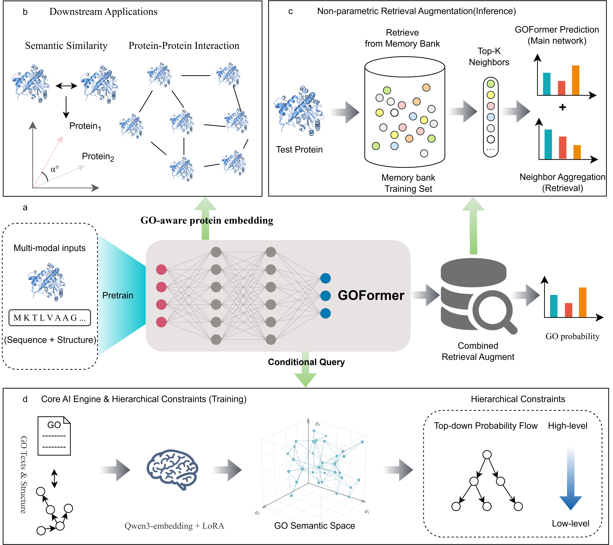

# GOFormer: hierarchy-aware multimodal learning for generalizable protein function annotation

## Introduction

GOFormer is a hierarchy-aware multimodal framework for generalizable protein function annotation across Molecular Function (MF), Cellular Component (CC), and Biological Process (BP).



The repository contains model, training, evaluation, and feature-preparation scripts. Datasets, extracted embeddings, ontology files, and trained checkpoints must be prepared separately.

## Preparation

Clone this repository or download the code as a ZIP archive.

GOFormer primarily relies on the following Python packages:

- python=3.9
- cuda=11.8
- numpy==1.26.4
- pandas==2.3.3
- datasets==4.5.0
- dgl==2.4.0+cu118
- fair_esm==2.0.0
- peft==0.17.1
- scipy ==1.13.1
- sentence_transformers==5.1.2
- torch==2.4.0+cu118
- tqdm==4.67.1

Create a conda environment and install dependencies:

```bash
conda create -n goformer python=3.9 -y
conda activate goformer
pip3 install torch torchvision --index-url https://download.pytorch.org/whl/cu118
conda install -c dglteam/label/th24_cu118 dgl
python -m pip install -r requirements.txt
```

The requirements pin CUDA 11.8 builds of PyTorch and DGL. Install these builds from their respective package repositories if they are unavailable through your default pip index.

## Usage

#### Data

Prepare the following files under `data/` (data files are not included):

```text
data/
├── go.obo
├── {split}_embeddings.pkl
├── embeddings/{split}_struct_embeddings.pt
├── {task}/
│   ├── {split}_{task}_multihot.pkl
│   └── go_parents_pair.pkl
├── none_finetuned_go_embeddings/{task}_go_pretrained_qwen3_from_all.pkl
└── weitiao_finetuned_go_embeddings/{task}_go_pretrained_qwen3_from_all.pkl
```

Here, `{split}` is `train`, `valid`, or `test`, and `{task}` is `bp`, `cc`, or `mf`. Preprocessing scripts are available in [`script/processed_data/`](script/processed_data/); adjust their input and output paths for your dataset. Keep GO term ordering consistent across labels, graphs, and GO embeddings.

Update data paths, label counts, and training settings in [`script/config.py`](script/config.py). Set `DEVICE` to an available device, such as `cuda:0` (the default is `cuda:1`).

If you would like to use our data, please download it [here](https://drive.google.com/file/d/1rH4oZODuC77ABOZbueVxbwv8rH9h71cr/view?usp=drive_link).

#### Train/test

Run commands from the `script/` directory:

```bash
cd script
# Choose a GO aspect: bp (Biological Process), cc (Cellular Component), or mf (Molecular Function)

# Train the model
python train.py --task bp

# Evaluate the trained model using the saved checkpoints
python test.py --task bp
```

If `--task` is omitted, BP is used by default.

Replace `bp` with `cc` or `mf` for the other GO aspects. Training saves checkpoints, logs, and predictions under `script/checkpoints/{task}/`, `script/logs/{task}/`, and `script/results/{task}/`. 

Outputs are saved relative to the `script/` directory:

| Output                       | Location                          |
| ---------------------------- | --------------------------------- |
| Model checkpoints            | `checkpoints/{task}/`             |
| Training logs                | `logs/{task}/`                    |
| Test predictions and metrics | `results/{task}/test_results.pkl` |

